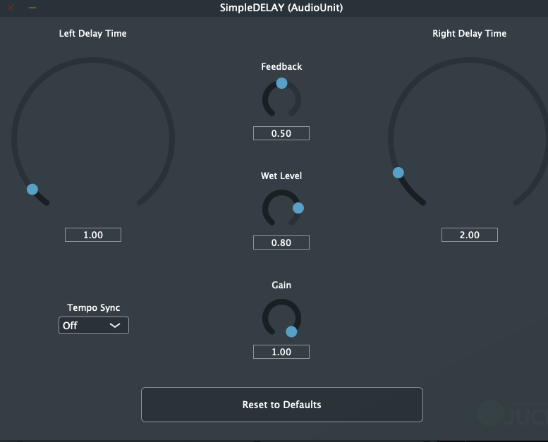

# SimpleDELAY

This is an implementation of a simple stereo delay plug-in based on the JUCE framework.

The plug-in is writen in C++. It is cross-platform and supports AU and VST3 formats.

The core delay component is almost entirely based on the delay line found in the JUCE string model tutorial 
(https://docs.juce.com/master/tutorial_dsp_delay_line.html#tutorial_dsp_delay_line_implement_delay_line). 
For this application, Delay was extended to support user control of feedback, wet and gain levels.

The delay's design is a simple circular buffer that also leverages a JUCE highpass filter.
The result is very sweet and smooth sounding delay. It is multi-channel capable out of the box, but for this application, only 2 channels are utilized.

The plug-in supports saving and restoring state.

## Controls

### Left/Right Delay Time:

Sets the left and right channel delay times in seconds. Maxium delay time is 2 seconds and can be changed in 1ms increments.

### Feedback:

Sets the gain level of the signal that is fed back into the delay lines.

### Wet Level:

Sets the gain level of the wet signal.

### Gain:

Sets the trim level percentage in case the signal is too hot.

### Tempo Sync:

Configures the plug-in to synchronize to the MIDI clock. User can select from a set of time divisions.

### Reset Delay Settings:

Sets all controls back to factory defaults.
